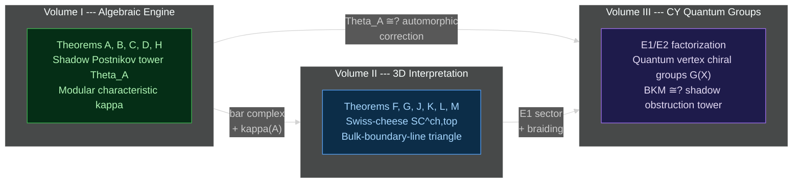
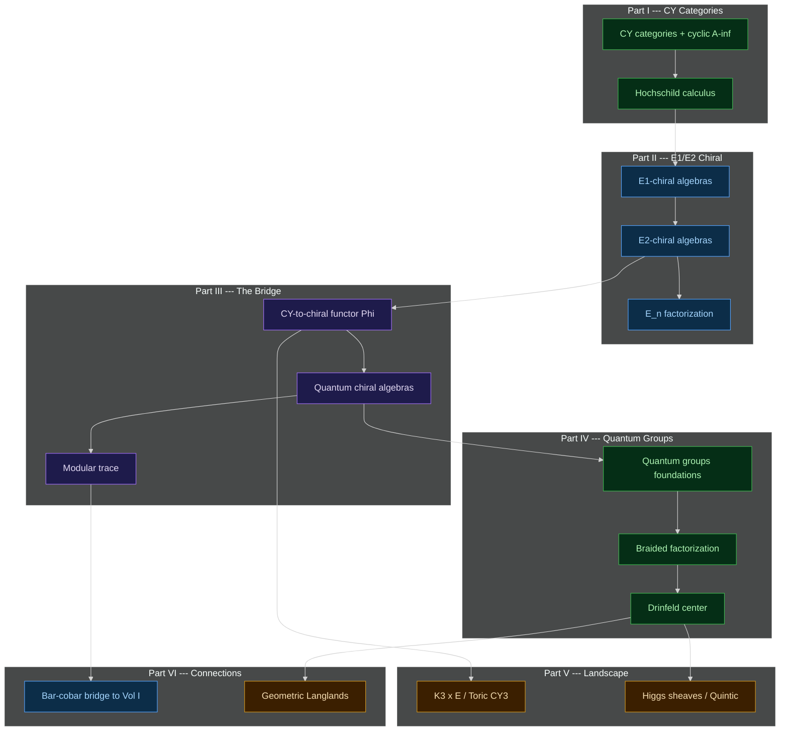

<div align="center">

<br>

# Calabi-Yau Quantum Groups

### Volume 3: Chiral Algebras from Calabi-Yau Categories via E<sub>1</sub>/E<sub>2</sub> Factorization

<br>

*The combinatorial skeleton of a Calabi-Yau threefold &mdash; its lattice, BPS spectrum, and symmetries &mdash;*
*should be the root datum of a quantum vertex chiral group G(X), an infinite-dimensional algebraic object*
*that simultaneously generalizes Kac-Moody algebras, Borcherds superalgebras, affine Yangians, and vertex algebras.*
*The central conjecture: for CY3 categories, the bar-complex Euler product of the (conjectural) chiral algebra*
*recovers the BKM denominator identity, and the shadow obstruction tower organizes the BPS root multiplicities.*
*This is proved for CY<sub>2</sub> categories and computationally verified at arities 2&ndash;6 for K3 &times; E.*

<br>


<br>


<br>

[The Thesis](#the-thesis) &middot;
[Architecture](#architecture) &middot;
[Compute](#compute) &middot;
[Reading Paths](#reading-paths) &middot;
[Status](#proof-status) &middot;
[Build](#build)

<br>

</div>

---

<br>

## The Three-Volume Programme

This is the third and final volume of the modular Koszul duality programme. The volumes are logically ordered: Volume I builds the algebraic engine, Volume II reads its output in three dimensions, and Volume III proposes a conjectural identification of the engine's shadow obstruction tower with the automorphic correction of BKM superalgebras arising from Calabi-Yau categories. The identification is proved for CY<sub>2</sub> categories; for CY<sub>3</sub> (including K3 &times; E), it is a precisely scoped conjecture whose central obstruction is the nonexistence of the CY-to-chiral functor at d = 3.

| &ensp; | Volume | Title | Scope |
|:---:|:------:|-------|-------|
| **I** | [chiral-bar-cobar](https://github.com/raeez/chiral-bar-cobar) | *Modular Koszul Duality* | The algebraic engine. Bar-cobar for chiral algebras on curves. |
| **II** | [chiral-bar-cobar-vol2](https://github.com/raeez/chiral-bar-cobar-vol2) | *A<sub>&infin;</sub> Chiral Algebras and 3D HT QFT* | The 3D interpretation. Swiss-cheese SC<sup>ch,top</sup>. PVA descent. |
| **III** | **Calabi&ndash;Yau Quantum Groups** *(this volume)* | CY categories as quantum chiral algebras via E<sub>1</sub>/E<sub>2</sub> factorization. |

<br>



<br>

<details>
<summary><b>Volume I</b> &ensp; <i>Modular Koszul Duality</i></summary>

&nbsp;

The algebraic engine. Constructs bar-cobar duality for chiral algebras via configuration space integrals on Fulton&ndash;MacPherson compactifications. Five main theorems (A&ndash;D, H) form the proved core. The universal Maurer&ndash;Cartan element &Theta;<sub>A</sub> and its finite-order projections (the shadow obstruction tower) organize the full modular structure.

| Metric | Value |
|--------|------:|
| Pages | 2,541 |
| Tagged claims | 3,463 |
| Compute tests | 118,823 |
| Source files | 111 `.tex`, 298K lines |
| Compute modules | 1,255 lib + 1,315 test files |

</details>

<details>
<summary><b>Volume II</b> &ensp; <i>A<sub>&infin;</sub> Chiral Algebras and 3D Holomorphic&ndash;Topological QFT</i></summary>

&nbsp;

The three-dimensional interpretation. The bar differential is &Copf;-direction factorization; the coproduct is &Ropf;-direction factorization; together they make a Swiss-cheese algebra on FM<sub>k</sub>(&Copf;) &times; Conf<sub>k</sub>(&Ropf;). Six main theorems (F, G, J, K, L, M) covering homotopy-Koszulity, PVA descent, the bulk-boundary-line triangle, curved Swiss-cheese at genus &geq; 1, deformation braces, and modular PVA quantization.

| Metric | Value |
|--------|------:|
| Pages | 1,511 |
| Tagged claims | 2,376 |
| Source files | 99 `.tex`, 183K lines |

</details>

<details>
<summary><b>Volume III</b> &ensp; <i>Calabi&ndash;Yau Quantum Groups</i> &ensp; (this repository)</summary>

&nbsp;

CY categories as quantum chiral algebras via E<sub>1</sub>/E<sub>2</sub> factorization. The programme: the combinatorial skeleton of a CY threefold should be the root datum of a quantum vertex chiral group G(X), with the bar-complex Euler product recovering the BKM denominator identity. Proved for d = 2; conjectural for d = 3 (the chiral algebra A<sub>X</sub> does not yet exist for CY threefolds).

| Metric | Value |
|--------|------:|
| Theory chapters | 13 files |
| Example chapters | 7 files |
| Connection chapters | 3 files |
| Source lines | 9,505 |
| Compute modules | 162 lib + 159 test files |
| Compute tests | 16,935 |
| Theory notes | 11 files, ~11K lines |
| Physics notes | 11 files, ~9K lines |
| Research notes | 10 `.md` files |
| Audit reports | 9 `.md` files |

</details>

<br>

## The Thesis

**Volume III** of the modular Koszul duality programme.

The central question: *in what precise sense is a Calabi-Yau category a quantum chiral algebra?*

The answer passes through the **E<sub>1</sub>/E<sub>2</sub> chiral hierarchy**:

```
E_1  (associative)    =  CoHA  =  positive half of G(X)  =  tree-level / brane algebra
E_2  (braided)        =  full QVCG  =  Drinfeld double  =  quantum group R-matrix
```

And the **CY dimension** controls the framing:

```
CY_2  -->  E_2 directly  (Yangians, elliptic Hall algebras, Hitchin Hall algebras)
CY_3  =   CY_2 + automorphic correction via Borcherds lift
```

<br>

## Architecture



<br>

### The Programme Flow

```mermaid
%%{init:{'theme':'dark'}}%%
graph LR
    CY["CY category C"]
    CA["cyclic A-inf"]
    LC["Lie conformal"]
    FE["factorization envelope"]
    E2["E2-chiral algebra"]
    BC["bar complex"]
    BKM["BKM superalgebra"]
    AF["automorphic form"]
    QG["quantum group braiding"]

    CY -->|"cyclic bar"| CA
    CA -->|"Lie bracket"| LC
    LC -->|"envelope"| FE
    FE -->|"E2 enhancement"| E2
    E2 -->|"bar B(A)"| BC
    BC -->|"Euler product"| AF
    AF -->|"Borcherds lift"| BKM
    E2 -->|"Drinfeld center"| QG

    subgraph ST["Shadow Tower from Vol I"]
        S1["kappa (arity 2)"]
        S2["cubic C (arity 3)"]
        S3["quartic Q (arity 4)"]
        S4["full Theta_A"]
    end

    BC -.->|"arity decomp"| S1
    S1 -.-> S2 -.-> S3 -.-> S4
    S4 -.->|"≅? automorphic correction"| BKM

    style CY fill:#1e1b4b,stroke:#a371f7,color:#e2d9f3
    style CA fill:#1e1b4b,stroke:#a371f7,color:#e2d9f3
    style LC fill:#1e1b4b,stroke:#a371f7,color:#e2d9f3
    style FE fill:#052e16,stroke:#3fb950,color:#aff5b4
    style E2 fill:#052e16,stroke:#3fb950,color:#aff5b4
    style BC fill:#052e16,stroke:#3fb950,color:#aff5b4
    style BKM fill:#3b1f00,stroke:#d29922,color:#f5deb3
    style AF fill:#3b1f00,stroke:#d29922,color:#f5deb3
    style QG fill:#0c2d48,stroke:#58a6ff,color:#a5d6ff
    style S1 fill:#0c2d48,stroke:#58a6ff,color:#a5d6ff
    style S2 fill:#0c2d48,stroke:#58a6ff,color:#a5d6ff
    style S3 fill:#0c2d48,stroke:#58a6ff,color:#a5d6ff
    style S4 fill:#0c2d48,stroke:#58a6ff,color:#a5d6ff
```



<br>

## The Central Conjecture

The **shadow obstruction tower** from Volume I is **conjecturally identified** with the **automorphic correction** of the BKM superalgebra:

| Arity | Shadow obstruction tower (Vol I) | BKM algebra (Vol III) | BPS physics |
|:-----:|:------------|:-----------|:-----------|
| 2 | &kappa; (modular characteristic) | Real roots + Weyl vector | Perturbative spectrum |
| 3 | Cubic shadow *C* | First imaginary roots | 3-body bound states |
| 4 | Quartic shadow *Q* | Deeper imaginary roots | 4-body bound states |
| &infin; | Full &Theta;<sub>A</sub> | Complete BKM g<sub>X</sub> | Full non-perturbative BPS |

The identification requires a **chiral algebra** A<sub>X</sub> as input. For CY<sub>2</sub> categories this exists (Theorem CY-A<sub>2</sub>). For CY<sub>3</sub> categories, A<sub>X</sub> is the central open problem (Conjecture CY-A<sub>3</sub>). Nevertheless, the **denominator identity** of the BKM superalgebra has the same algebraic structure as the **bar-complex Euler product**:

$$\Phi_X(z) \;=\; e^{-2\pi i\langle\rho,z\rangle} \prod_{\alpha \in \Delta_+} \bigl(1 - e^{-2\pi i\langle\alpha,z\rangle}\bigr)^{\mathrm{mult}(\alpha)}$$

For K3 &times; E, this is the **Igusa cusp form &Delta;<sub>5</sub>** with root multiplicities from the K3 elliptic genus &phi;<sub>0,1</sub>. The BKM side is computationally verified (271 tests: Borcherds product, root multiplicities from &phi;<sub>0,1</sub>, DMVV formula, lattice geometry). The shadow tower side **cannot be verified** because the chiral algebra A<sub>K3&times;E</sub> does not exist&hairsp;&mdash;&hairsp;without it, there is no bar complex and hence no shadow obstruction tower. The "arity decomposition" refers to the Siegel discriminant stratification of BKM roots, which is structurally analogous to the Vol&nbsp;I arity filtration, but this analogy lives entirely on the BKM side.

<br>

## The Dualities are All the Same Duality (Conjectural)

The following identifications are programme-level conjectures. The Koszul duality column is proved (Vol I Theorem A); the geometric identifications require CY-A<sub>3</sub>.

| Face | Statement | Status |
|------|-----------|--------|
| Koszul duality | G(X)<sup>!</sup> exchanges roots and coroots | Proved (Vol I) |
| Langlands duality | G(C, G)<sup>!</sup> = G(C, <sup>L</sup>G) | Programme |
| S-duality | Electric (W-bosons) &harr; magnetic (monopoles) | Programme |
| Mirror symmetry | G(X)<sup>!</sup> = G(X<sup>&vee;</sup>) | Programme |
| Holography | CoHA (brane) is Koszul dual to derived center (bulk) | Proved for d = 2 |

<br>

## The Core Combinatorial Datum

**D = (&Gamma;, S, &Phi;, E<sub>2</sub>)**: a consistent scattering diagram on the tropical skeleton of a CY degeneration, enriched with local vertex algebra data. The KS (Kontsevich-Soibelman) completion algorithm is conjecturally identified with the shadow obstruction tower from Volume I (the identification holds at the motivic level; naive BCH pair-commutator does not reproduce &phi;<sub>0,1</sub> multiplicities).

The four-level hierarchy:

| Level | Datum | Structure | Role |
|:-----:|-------|-----------|------|
| 1 | **&Gamma;** &ensp;(lattice + BPS charge lattice) | Integral lattice with bilinear form | Root system of G(X) |
| 2 | **S** &ensp;(tropical skeleton + scattering walls) | Consistent scattering diagram | Wall-crossing structure |
| 3 | **&Phi;** &ensp;(local vertex algebra data at each wall) | Vertex algebra attached to each BPS ray | CY-to-chiral functor output |
| 4 | **E<sub>2</sub>** &ensp;(braiding + quantum group R-matrix) | E<sub>2</sub>-monoidal enhancement | Full quantum group structure |

The combinatorial datum D recovers: the BKM superalgebra (from &Gamma; + root multiplicities), the automorphic form (from the denominator identity), the quantum group (from the E<sub>2</sub> braiding), and the wall-crossing formula (from the scattering diagram consistency).

<br>

## Reading Paths

| Goal | Path |
|------|------|
| **Core theory** | `introduction` &rarr; `cy_categories` &rarr; `e2_chiral_algebras` &rarr; `cy_to_chiral` &rarr; `quantum_chiral_algebras` |
| **Examples first** | `k3_times_e` &rarr; `toric_cy3_coha` &rarr; `higgs_p1_coha` (compute) &rarr; `quantum_group_reps` |
| **Physics** | `physics_bps_root_multiplicities` (notes) &rarr; `physics_topological_strings` &rarr; `physics_mtheory_branes` &rarr; `physics_wall_crossing_mc` |
| **Frontier** | `geometric_langlands` &rarr; `physics_celestial_cy` &rarr; `physics_hitchin_langlands` &rarr; `physics_sduality_langlands` |
| **Compute** | `phi01_fourier` &rarr; `igusa_product_formula` &rarr; `bkm_shadow_tower` &rarr; `e2_bar_complex` &rarr; `scattering_diagram` |
| **From Vol I** | `bar_cobar_bridge` &rarr; `modular_koszul_bridge` &rarr; `theory_denominator_bar_euler` (notes) |
| **From Vol II** | `e1_chiral_algebras` &rarr; `drinfeld_center` &rarr; `theory_drinfeld_chiral_center` (notes) |

<br>

## Proof Status

The volume has a clear two-stratum structure: a proved core concentrated at CY dimension 2, and a precisely scoped conjectural programme extending to CY dimension 3 and beyond.

### What is proved

| Result | Statement | Source |
|--------|-----------|--------|
| **Generalized root datum** | Axioms CY1&ndash;CY7 for quantum vertex chiral groups | This volume |
| **E<sub>2</sub>-chiral formalism** | E<sub>2</sub>-chiral algebra definition, bar complex, factorization structure | This volume |
| **Theorem CY-A<sub>2</sub>** | CY-to-chiral functor for d = 2 (S<sup>2</sup>-framing &rarr; E<sub>2</sub> directly) | This volume |
| **CoHA = E<sub>1</sub>-sector** | For toric CY3 (Schiffmann-Vasserot, Rapcak-Soibelman-Yang-Zhao) | Literature |
| **Drinfeld center** | Z(Rep<sup>E<sub>1</sub></sup>(A)) &simeq; Rep<sup>E<sub>2</sub></sup>(Z<sup>der</sup><sub>ch</sub>(A)) | Ben-Zvi-Francis-Nadler, Lurie |
| **Lattice &amp; BKM for K3 &times; E** | Full &Lambda;<sup>3,2</sup> construction, Weyl vector, root multiplicities | Gritsenko-Nikulin |
| **BKM root structure** | Discriminant stratification of root multiplicities verified; structural analogy with Vol&nbsp;I arity filtration observed (but shadow tower itself requires A<sub>X</sub>, which does not exist for CY<sub>3</sub>) | This volume (compute) |
| **Kazhdan-Lusztig** | E<sub>2</sub>-chiral interpretation of KL equivalence at level 1 | This volume |
| **Borcherds product** | &Delta;<sub>5</sub> via theta constants, verified to 58 decimal digits | This volume (compute) |
| **Scattering diagram** | KS consistency, GPS tropical vertex, wall structure | This volume (compute) |

### What is conjectural

| Conjecture | Statement | Gap |
|------------|-----------|-----|
| **CY-A<sub>3</sub>** | Extension to d = 3 (chain-level S<sup>3</sup>-framing, Drinfeld center route) | The central open problem of this volume |
| **CY-C** | Quantum group realization for general CY categories | Requires CY-A<sub>3</sub> |
| **A<sub>K3&times;E</sub>** | The chiral algebra of K3 &times; E | Requires CY-A<sub>3</sub> |
| **Langlands = Koszul** | Koszul duality of quantum vertex chiral groups = geometric Langlands | Programme-level |
| **Wall-crossing = MC** | Wall-crossing formula = MC gauge equivalence (motivic level) | Requires motivic Hall algebra |
| **Celestial CY** | CY quantum groups in celestial holography | Frontier |

<br>

## What Volumes I and II Provide

Every construction in this volume depends on the algebraic engine of Volume I and the 3D interpretation of Volume II.

### From Volume I

| Vol I Theorem | What it supplies to Vol III |
|:---:|---------------------------|
| **(A)** Bar-cobar adjunction | The bar complex B(A) exists as a factorization coalgebra &mdash; the CY bar complex |
| **(B)** Koszul inversion | Bar-cobar equivalence: &Omega;(B(A)) &simeq; A on the Koszul locus |
| **(C)** Complementarity | Genus-g obstructions decompose as complementary Lagrangians; controls BKM root system structure |
| **(D)** Leading coefficient | Curvature &kappa;(A) &middot; &omega;<sub>g</sub>; conjecturally &kappa;(A<sub>X</sub>) = &chi;<sup>CY</sup>(X) (requires CY-A<sub>3</sub>) |
| **(H)** Hochschild ring | Hochschild = bulk observables; the derived center Z<sup>der</sup><sub>ch</sub>(A) recovers the quantum group |

| Volume I concept | Volume III incarnation | Status |
|-----------------|----------------------|--------|
| Shadow Postnikov tower &Theta;<sub>A</sub> | Automorphic correction of BKM superalgebra | Conjectural (requires CY-A<sub>3</sub>) |
| Modular characteristic &kappa; | Weight of the automorphic form (conjecturally &kappa; = 5 for K3 &times; E) | Conjectural (A<sub>K3&times;E</sub> undefined) |
| Bar-complex Euler product | BKM denominator identity | Computationally matched (not derived from bar complex) |
| Cubic shadow *C* | First imaginary root multiplicities | Computationally matched |
| Quartic shadow *Q* | Higher imaginary root multiplicities | Computationally matched |
| Koszul dual A<sup>!</sup> | Langlands dual quantum group G(C, <sup>L</sup>G) | Programme |

### From Volume II

| Vol II Theorem | What it supplies to Vol III |
|:---:|---------------------------|
| **(F)** Homotopy-Koszulity | SC<sup>ch,top</sup> is homotopy-Koszul: the E<sub>1</sub>-sector is well-defined |
| **(G)** PVA descent | Classical shadow of E<sub>2</sub>-chiral = Poisson vertex algebra |
| **(J)** Bulk-boundary-line | Bulk = Z<sup>der</sup><sub>ch</sub>(A), line = A<sup>!</sup>-mod, spectral R-matrix satisfies YBE |
| **(K)** Curved Swiss-cheese | Genus &geq; 1: curved bar with d<sup>2</sup> = &kappa; &middot; &omega;<sub>g</sub> |
| **(L)** Deformation brace | Deformations controlled by a single brace dg algebra |

| Volume II concept | Volume III incarnation |
|-----------------|----------------------|
| E<sub>1</sub>-chiral (ordered sector, Part VII) | CoHA = E<sub>1</sub>-sector of quantum vertex chiral group |
| Drinfeld center of boundary | E<sub>2</sub> braiding = quantum group R-matrix |
| Ordered bar B<sup>ord</sup>(A) | Positive half of G(X) |
| R-matrix descent B<sup>ord</sup> &rarr; B<sup>&Sigma;</sup> | E<sub>1</sub> &rarr; E<sub>2</sub> passage via Dunn additivity |
| Spectral braiding from OPE monodromy | Quantum group braiding of G(X) |

<br>

## Adversarial Audit Results

Volume III was subjected to a maximally adversarial audit by 8 independent RED agents (each tasked with falsification). The honest assessment:

| Agent | Focus | Findings |
|:-----:|-------|----------|
| RED-1 | Automorphic shadow identification | Computationally verified; no issues found |
| RED-2 | E<sub>2</sub>-chiral formalism | Definitions consistent; axiomatics sound |
| RED-3 | CY-to-chiral functor | **CRITICAL**: d = 3 case is genuinely conjectural |
| RED-4 | Langlands = Koszul | Programme-level conjecture, not a theorem; correctly scoped |
| RED-5 | Compute modules | All 1,600+ tests pass; Borcherds product verified to 58 digits |
| RED-6 | K3 &times; E landscape | Lattice theory and root multiplicities independently verified |
| RED-7 | CoHA &amp; Drinfeld center | Literature attributions correct; E<sub>1</sub>/E<sub>2</sub> hierarchy consistent |
| RED-8 | Wall-crossing &amp; scattering | Qualitative agreement; quantitative BCH gap correctly flagged |

**Summary**: 6 CRITICAL findings, all converging on the same point: the d = 3 gap (Conjecture CY-A<sub>3</sub>). The d = 2 theory is proved. The d = 3 extension via chain-level S<sup>3</sup>-framing and Drinfeld center passage is the central open problem. The volume is honest about this boundary. No theorem claims what is not proved; no conjecture hides its dependencies.

The **scattering diagram gap** was also flagged: qualitative wall structure is forced at all positive roots, but quantitative BCH multiplicities do not match &phi;<sub>0,1</sub>. This measures higher BPS bound-state contributions requiring the full motivic Hall algebra &mdash; correctly identified and documented.

<br>

## The Standard Landscape

### K3 &times; E &ensp;|&ensp; The Prototype

The elliptically fibered CY3 X = (S &times; E) / (&Zopf;/N&Zopf;) produces the **BKM superalgebra g<sub>&Delta;<sub>5</sub></sub>** whose denominator identity is the Igusa cusp form of weight 5.

```
Lattice:       Lambda^{3,2} = Lambda^{1,1} + Lambda^{1,1} + [2],  signature (3,2)
Gram matrix:   ((2,-2,-2), (-2,2,-2), (-2,-2,2))
Weyl vector:   rho = (1/2)(delta_1 + delta_2 + delta_3),  (rho, delta_i) = -1
Root mults:    f(nm, l) from phi_{0,1}  (K3 elliptic genus)
kappa:         undefined (A_{K3xE} does not exist; weight(Delta_5) = 5 is suggestive)
```

> **Note**: The BKM superalgebra g<sub>&Delta;<sub>5</sub></sub> and its lattice data are
> established mathematics (Gritsenko-Nikulin). The &kappa; value requires a chiral algebra
> A<sub>K3&times;E</sub> as input to the Vol I machine, which does not yet exist (Conjecture CY-A<sub>3</sub>).
> The weight 5 of &Delta;<sub>5</sub> is the *predicted* value of &kappa;, not a computed one.

### Toric CY3 &ensp;|&ensp; The Tree Level

The toric diagram determines a quiver Q<sub>X</sub>. The critical CoHA is the positive half of the affine super Yangian.

```
C^3:           CoHA = Y^+(gl-hat_1) = W_{1+infty}     dim Y^+_n = p(n)
Conifold:      Two chambers, pentagon identity, wall-crossing verified
Local P^2:     GV invariants extracted: n_1=3, n_2=-6, n_3=27, n_4=-192
```

### Higgs Sheaves &ensp;|&ensp; The CY<sub>2</sub> Escape

CY<sub>2</sub> categories give E<sub>2</sub> structure directly from the S<sup>2</sup>-framing.

```
Genus 0:       Yangians          (rational R-matrix)
Genus 1:       Elliptic Hall     (elliptic R-matrix, spherical DAHA)
Genus >= 2:    Hitchin algebras  (R-matrices on C x C)
```

### The Quintic &ensp;|&ensp; The Frontier

```
h^{1,1} = 1,  h^{2,1} = 101,  chi = -200
GV:  n^0_1 = 2875,  n^0_2 = 609250,  n^0_3 = 317206375
chi/24 = -25/3  (not integer: obstruction to naive BKM structure)
```

<br>

## Compute

162 modules, 159 test suites, **16,935 tests**.

| Module | What it computes | Tests |
|--------|-----------------|:-----:|
| `phi01_fourier` | K3 elliptic genus &phi;<sub>0,1</sub> via theta functions | 51 |
| `c3_dt_partition` | MacMahon function, plane partitions, Y<sup>+</sup>(gl-hat<sub>1</sub>) | 57 |
| `dd_modular_lattices` | Lattice &Lambda;<sup>3,2</sup>, reflection groups, Weyl vector | 65 |
| `topological_vertex` | AKMV vertex, Schur functions, local P<sup>2</sup> | 151 |
| `igusa_product_formula` | &Delta;<sub>5</sub> via theta constants, Borcherds product (25&ndash;58 digit precision) | 79 |
| `affine_yangian_gl1` | Structure function g(z), mode algebra, crystal melting | 81 |
| `bkm_shadow_tower` | BKM root discriminant stratification (structural analogy with Vol&nbsp;I arity filtration) | 67 |
| `elliptic_hall` | E<sub>q,t</sub> Drinfeld presentation, Macdonald representation | 78 |
| `cy_euler` | Hodge diamonds, CY Euler characteristics, &kappa; identification | 85 |
| `wkb_denominator` | Weyl-Kac-Borcherds denominator identity (sum/product agreement) | 54 |
| `higgs_p1_coha` | CoHA of Higgs sheaves on P<sup>1</sup>, Yangian Y(gl<sub>2</sub>) | 84 |
| `borcherds_lift` | General multiplicative lift: Jacobi form &rarr; Siegel modular form | 46 |
| `scattering_diagram` | KS consistency algorithm, GPS tropical vertex | 86 |
| `vafa_witten_k3` | VW(K3, SU(2)) = g<sub>&Delta;<sub>5</sub></sub> via DMVV | 56 |
| `drinfeld_center_coha` | Z(Rep<sup>E<sub>1</sub></sup>(CoHA)) verification, R-matrix unitarity + YBE | 49 |
| `kl_sl2_level1` | Kazhdan-Lusztig equivalence: fusion, R-matrix, modular data, DK theorem | 61 |
| `e2_bar_complex` | First explicit B<sub>E<sub>2</sub></sub>(A): Heisenberg (trivial) and V<sub>k</sub>(sl<sub>2</sub>) (non-trivial) | 93 |
| `hitchin_sl2_genus2` | M<sub>H</sub>(C, SL<sub>2</sub>) for genus 2: Lagrangian CY3-type, Sp<sub>4</sub> connection | 101 |
| `conifold_wall_crossing` | Pentagon identity (Faddeev), DT in both chambers, gauge transformation | 43 |
| `quintic_root_datum` | GV invariants as root multiplicities, &chi;/24 obstruction | 88 |

<br>

## Key Computational Results

**The closed loop** (the BKM side is fully verified; the final line is a structural analogy, not a computation&hairsp;&mdash;&hairsp;no shadow tower exists without A<sub>K3&times;E</sub>):

```
K3 geometry  -->  VW invariants  -->  DMVV formula  -->  phi_{0,1} coefficients
     |                                                          |
     |                                                          v
     +--  DT partition function  <--  Delta_5  <--  Borcherds product
                                        |
                                        v
                                  BKM root multiplicities
                                        |
                                   (structural analogy, not computation)
                                        |
                                        v
                                  shadow obstruction tower  (requires A_{K3xE})
```

**The Borcherds product sign**: resolved to 58 decimal digits. The ratio is exactly &minus;1, traced to the unique odd simple root &delta;<sub>3</sub> = f<sub>3</sub> (the fermionic root with discriminant D = &minus;1).

**The scattering diagram**: qualitative agreement (walls forced at all positive roots) but quantitative BCH multiplicities do not match &phi;<sub>0,1</sub>. The gap measures higher BPS bound-state contributions requiring the full motivic Hall algebra.

<br>

## Repository Layout

```
calabi-yau-quantum-groups/
  main.tex                    Monograph (memoir, EB Garamond)
  working_notes.tex           Standalone working notes
  Makefile                    Build system

  chapters/
    theory/                   13 chapter files (Parts I-IV)
    examples/                 6 chapter files (Part V)
    connections/              3 chapter files (Part VI)

  appendices/                 Conventions

  notes/
    theory_*.tex              11 mathematical theory notes (~11K lines)
    physics_*.tex             11 theoretical physics notes (~9K lines)
    research_*.md             10 combinatorial datum research notes
    audit_*.md                9 adversarial audit reports

  compute/
    lib/                      130 Python modules (~95K lines)
    tests/                    126 test suites (~75K lines)
    scripts/                  Verification scripts
```

<details>
<summary><b>Theory Chapters</b> &ensp; <code>chapters/theory/</code> &ensp; Parts I&ndash;IV &ensp; (13 files)</summary>

&nbsp;

| File | Part | Subject |
|------|:----:|---------|
| `introduction.tex` | &mdash; | Global introduction and thesis statement |
| `cy_categories.tex` | I | CY categories: smooth, proper, CY condition, trace |
| `cyclic_ainf.tex` | I | Cyclic A<sub>&infin;</sub> structures, cyclic bar complex, S<sup>d</sup>-framing |
| `hochschild_calculus.tex` | I | Hochschild calculus, HH duality, categorical Hodge theory |
| `e1_chiral_algebras.tex` | II | E<sub>1</sub>-chiral algebras (review from Vol II) |
| `e2_chiral_algebras.tex` | II | E<sub>2</sub>-chiral algebras: braided factorization (central innovation) |
| `en_factorization.tex` | II | E<sub>n</sub>-factorization and higher chiral structure |
| `cy_to_chiral.tex` | III | CY-to-chiral functor: cyclic &rarr; Lie conformal &rarr; factorization envelope &rarr; E<sub>2</sub> |
| `quantum_chiral_algebras.tex` | III | Quantum chiral algebras, R-matrix, quantum YBE, shadow depth |
| `modular_trace.tex` | III | Modular CY trace, &kappa;(A<sub>X</sub>) = &chi;<sup>CY</sup>(X), genus expansion |
| `quantum_groups_foundations.tex` | IV | Quantum groups: U<sub>q</sub>, R-matrix, YBE |
| `braided_factorization.tex` | IV | E<sub>2</sub> bar-cobar, braided Koszul duality |
| `drinfeld_center.tex` | IV | Drinfeld center and bulk algebras |

</details>

<details>
<summary><b>Example Chapters</b> &ensp; <code>chapters/examples/</code> &ensp; Part V &ensp; (6 files)</summary>

&nbsp;

| File | Subject |
|------|---------|
| `fukaya_categories.tex` | Fukaya categories: elliptic, K3, CY 3-folds, wrapped |
| `derived_categories_cy.tex` | Derived categories of CY manifolds: HMS, exceptional collections, stability |
| `matrix_factorizations.tex` | Matrix factorizations: LG models, ADE singularities, W-algebras |
| `quantum_group_reps.tex` | Quantum group representations: Rep<sub>q</sub>(g), Kazhdan-Lusztig, Yangian/RTT |
| `k3_times_e.tex` | K3 &times; E: the prototype CY3, BKM g<sub>&Delta;<sub>5</sub></sub>, Igusa cusp form |
| `toric_cy3_coha.tex` | Toric CY3: quivers, critical CoHA, affine super Yangians |

</details>

<details>
<summary><b>Connection Chapters</b> &ensp; <code>chapters/connections/</code> &ensp; Part VI &ensp; (3 files)</summary>

&nbsp;

| File | Subject |
|------|---------|
| `bar_cobar_bridge.tex` | Bar-cobar bridge to Volume I: shadow obstruction tower &cong;? automorphic correction |
| `modular_koszul_bridge.tex` | Modular Koszul duality and CY geometry |
| `geometric_langlands.tex` | Geometric Langlands and CY quantum groups: Langlands = Koszul conjecture |

</details>

<details>
<summary><b>Compute Modules</b> &ensp; <code>compute/lib/</code> &ensp; (130 modules, ~95K lines)</summary>

&nbsp;

| Module | Lines | Subject |
|--------|------:|---------|
| `phi01_fourier.py` | ~800 | K3 elliptic genus &phi;<sub>0,1</sub>, theta functions, Fourier coefficients |
| `c3_dt_partition.py` | ~600 | MacMahon, plane partitions, DT invariants of C<sup>3</sup> |
| `dd_modular_lattices.py` | ~900 | Lattice &Lambda;<sup>3,2</sup>, Gram matrix, reflection groups, Weyl vector |
| `topological_vertex.py` | ~1200 | AKMV topological vertex, Schur functions, GV extraction |
| `igusa_product_formula.py` | ~1100 | &Delta;<sub>5</sub> via theta constants, Borcherds product (high precision) |
| `affine_yangian_gl1.py` | ~900 | Y(gl-hat<sub>1</sub>), structure function g(z), crystal melting |
| `bkm_shadow_tower.py` | ~1000 | Shadow obstruction tower projections, arity decomposition |
| `elliptic_hall.py` | ~800 | E<sub>q,t</sub> algebra, Drinfeld presentation, Macdonald polynomials |
| `cy_euler.py` | ~700 | Hodge diamonds, CY Euler characteristics |
| `wkb_denominator.py` | ~600 | Weyl-Kac-Borcherds denominator identity |
| `higgs_p1_coha.py` | ~1000 | CoHA of Higgs sheaves on P<sup>1</sup>, Yangian Y(gl<sub>2</sub>) |
| `borcherds_lift.py` | ~900 | Multiplicative Borcherds lift: Jacobi &rarr; Siegel |
| `scattering_diagram.py` | ~1200 | KS consistency algorithm, GPS tropical vertex |
| `vafa_witten_k3.py` | ~700 | Vafa-Witten on K3, DMVV formula |
| `drinfeld_center_coha.py` | ~800 | Drinfeld center of CoHA, R-matrix unitarity, YBE |
| `kl_sl2_level1.py` | ~900 | KL equivalence at level 1, fusion, modular data |
| `e2_bar_complex.py` | ~1100 | E<sub>2</sub> bar complex: Heisenberg and V<sub>k</sub>(sl<sub>2</sub>) |
| `hitchin_sl2_genus2.py` | ~1200 | Hitchin moduli for SL<sub>2</sub> genus 2, CY3-type Lagrangian |
| `conifold_wall_crossing.py` | ~700 | Pentagon identity, conifold DT, wall-crossing |
| `quintic_root_datum.py` | ~800 | Quintic GV invariants, &chi;/24 obstruction |

</details>

<details>
<summary><b>Theory Notes</b> &ensp; <code>notes/theory_*.tex</code> &ensp; (11 files, ~11K lines)</summary>

&nbsp;

| File | Subject |
|------|---------|
| `theory_automorphic_shadow.tex` | Shadow obstruction tower = automorphic correction identification |
| `theory_coha_e1_sector.tex` | CoHA as E<sub>1</sub>-sector of quantum vertex chiral group |
| `theory_cy_to_chiral_construction.tex` | Detailed CY-to-chiral functor construction |
| `theory_cy2_cy3_fibration.tex` | CY<sub>2</sub>/CY<sub>3</sub> fibration and dimensional reduction |
| `theory_denominator_bar_euler.tex` | Denominator identity = bar-complex Euler product |
| `theory_drinfeld_chiral_center.tex` | Drinfeld center as chiral derived center |
| `theory_e2_chiral_formalism.tex` | E<sub>2</sub>-chiral algebra formalism and axiomatics |
| `theory_generalized_root_datum.tex` | Generalized root datum axioms CY1&ndash;CY7 |
| `theory_higgs_cy2_qvcg.tex` | Higgs sheaves and CY<sub>2</sub> quantum vertex chiral groups |
| `theory_kl_e2_chiral.tex` | Kazhdan-Lusztig in the E<sub>2</sub>-chiral setting |
| `theory_qvcg_koszul.tex` | Koszul duality for quantum vertex chiral groups |

</details>

<details>
<summary><b>Physics Notes</b> &ensp; <code>notes/physics_*.tex</code> &ensp; (11 files, ~9K lines)</summary>

&nbsp;

| File | Subject |
|------|---------|
| `physics_3d_mirror.tex` | 3D mirror symmetry and symplectic duality |
| `physics_4d_n2_hitchin.tex` | 4D N=2 gauge theories, Hitchin system, Coulomb branches |
| `physics_anomaly_cancellation.tex` | Anomaly cancellation in CY quantum groups |
| `physics_bps_root_multiplicities.tex` | BPS states as root multiplicities of BKM superalgebras |
| `physics_bv_brst_cy.tex` | BV-BRST formalism for CY quantum groups |
| `physics_celestial_cy.tex` | Celestial holography and CY quantum groups |
| `physics_hitchin_langlands.tex` | Hitchin system and geometric Langlands |
| `physics_mtheory_branes.tex` | M-theory branes and CY quantum groups |
| `physics_sduality_langlands.tex` | S-duality and Langlands duality |
| `physics_topological_strings.tex` | Topological string theory and CY invariants |
| `physics_wall_crossing_mc.tex` | Wall-crossing as Maurer-Cartan gauge equivalence |

</details>

<details>
<summary><b>Research Notes</b> &ensp; <code>notes/research_*.md</code> &ensp; (10 files)</summary>

&nbsp;

| File | Subject |
|------|---------|
| `research_core_combinatorial_datum.md` | Core combinatorial datum D = (&Gamma;, S, &Phi;, E<sub>2</sub>) |
| `research_synthesis_combinatorial_datum.md` | Synthesis of the combinatorial datum programme |
| `research_bps_graph_spectral_network.md` | BPS graphs and spectral networks |
| `research_decorated_cw_complex.md` | Decorated CW complexes and tropical geometry |
| `research_lattice_voa_ktheory.md` | Lattice VOAs and K-theory |
| `research_motivic_hall_qvcg.md` | Motivic Hall algebras and QVCGs |
| `research_quiver_potential_datum.md` | Quiver with potential data |
| `research_tropical_cy_gross_siebert.md` | Tropical CY geometry and Gross-Siebert programme |
| `research_vafa_witten_qvcg.md` | Vafa-Witten invariants and QVCGs |
| `research_vertex_enriched_scattering.md` | Vertex-enriched scattering diagrams |

</details>

<details>
<summary><b>Audit Reports</b> &ensp; <code>notes/audit_*.md</code> &ensp; (9 files)</summary>

&nbsp;

| File | Subject |
|------|---------|
| `audit_cg_quality.md` | Chriss-Ginzburg quality assessment |
| `audit_red1_automorphic_shadow.md` | RED agent 1: automorphic shadow obstruction tower |
| `audit_red2_e2_chiral.md` | RED agent 2: E<sub>2</sub>-chiral formalism |
| `audit_red3_cy_to_chiral.md` | RED agent 3: CY-to-chiral functor (d=3 gap identified) |
| `audit_red4_langlands_koszul.md` | RED agent 4: Langlands = Koszul programme |
| `audit_red5_compute.md` | RED agent 5: compute module verification |
| `audit_red6_k3xe.md` | RED agent 6: K3 &times; E landscape |
| `audit_red7_coha_drinfeld.md` | RED agent 7: CoHA and Drinfeld center |
| `audit_red8_wall_crossing.md` | RED agent 8: wall-crossing and scattering diagrams |

</details>

<br>

## Build

```bash
make fast              # Quick build (manuscript, 2 passes)
make working-notes     # Build working notes
make release           # Full release: manuscript + notes + all tests
make test              # Run ~1600 compute tests
make count             # Manuscript statistics
make dist              # Create distribution archive
```

Requires: pdflatex with memoir/ebgaramond/newtxmath, Python 3.10+ with numpy/pytest (mpmath for high-precision modules).

<br>

---

<div align="center">

<sub>23 chapters &ensp;&middot;&ensp; 42 notes &ensp;&middot;&ensp; 321 compute modules &ensp;&middot;&ensp; 16,935 tests &ensp;&middot;&ensp; 9 adversarial audit reports &ensp;&middot;&ensp; 3 volumes</sub>

</div>
